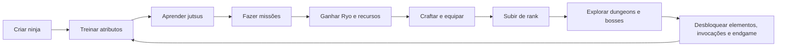

# Naruto Shinobi RPG

Servidor MMORPG inspirado em uma jornada shinobi original, criado como documentação inicial para um projeto em **TFS 1.4.2 + OTCv8**.

O jogador não começa como um personagem famoso. Ele cria o próprio ninja, treina, aprende jutsus, sobe de rank, trabalha para a aldeia, participa da economia e constrói sua reputação.

---

## Menu Principal

| 🧭 Conceito | ⚔️ Sistemas | 🏯 Mundo | 🛠️ Técnico | 🗺️ Planejamento |
| --- | --- | --- | --- | --- |
| [Visão geral](docs/00-visao-geral.md) | [Progressão e ranks](docs/sistemas/progressao-ranks-classes.md) | [Aldeias e NPCs](docs/mundo/aldeias-npcs-missoes-da-aldeia.md) | [Servidor TFS](docs/tecnico/estrutura-servidor-tfs.md) | [Roadmap](docs/planejamento/roadmap.md) |
| [Documento original](estrutura-ideia-servidor-naruto.md) | [Atributos e builds](docs/sistemas/atributos-builds.md) | [Mapa e regiões](docs/mundo/mapa-regioes.md) | [Cliente OTCv8](docs/tecnico/estrutura-cliente-otcv8.md) | [Backlog](docs/planejamento/backlog-ideias.md) |
| [Índice completo](docs/README.md) | [Elementos e jutsus](docs/sistemas/elementos-jutsus-invocacoes.md) | Missões da aldeia | Storages e scripts | [Template de sistema](docs/TEMPLATE-SISTEMA.md) |
| [Contribuição](CONTRIBUTING.md) | [Itens e raridade](docs/sistemas/itens-raridade-equipamentos.md) | Casas e vilas | UI e módulos | Fases do MVP |
|  | [Economia](docs/sistemas/economia.md) |  |  |  |
|  | [Crafting e profissões](docs/sistemas/crafting-profissoes-coleta.md) |  |  |  |
|  | [Missões](docs/sistemas/missoes.md) |  |  |  |
|  | [Dungeons e bosses](docs/sistemas/dungeons-bosses.md) |  |  |  |
|  | [Eventos e estações](docs/sistemas/eventos-estacoes.md) |  |  |  |
|  | [Casas](docs/sistemas/habitacao-casas.md) |  |  |  |

---

## Leitura Rápida

<strong>🔥 O que torna o projeto diferente?</strong>

- O jogador não controla personagens prontos do anime.
- A fantasia principal é construir uma carreira ninja própria.
- Jutsus são aprendidos por requisitos, treino, pergaminhos, missões e mestres.
- Elementos, profissões, equipamentos e invocações moldam a build.
- A aldeia funciona como centro de progressão, economia e reputação.

<strong>🌪️ Quais sistemas já foram planejados?</strong>

- Progressão por rank: Academia, Genin, Chunin, Jonin, ANBU e endgame.
- Atributos: level, treino, mentalidade, chakra, vida e resistências.
- Elementos: Katon, Suiton, Raiton, Doton e Fuuton.
- Jutsus com domínio e requisitos.
- Itens com raridade, equipamentos, pergaminhos e materiais.
- Economia com Ryo, reputação, mercado futuro e gastos úteis.
- Profissões: pesca, lenhador, herbalismo, mineração, artesão, escriba e cozinheiro.
- Missões da aldeia, missões de rank, dungeons, bosses, eventos e estações.

<strong>🍃 Qual é o MVP sugerido?</strong>

- Konoha como aldeia inicial.
- Progressão até Chunin ou Jonin inicial.
- Cinco elementos base.
- Sistema inicial de level, treino e mentalidade.
- Missões de academia, rank D, C e B.
- Economia simples com loot, lojas, dinheiro e crafting.
- Profissões iniciais de coleta.
- Duas dungeons, alguns bosses e um evento semanal.

---

## Painel dos Sistemas

| Ícone | Sistema | Ideia central |
| --- | --- | --- |
| 🥷 | [Progressão, classes e promoções](docs/sistemas/progressao-ranks-classes.md) | Carreira shinobi com exames, ranks e especializações. |
| 💪 | [Atributos e builds](docs/sistemas/atributos-builds.md) | Level, treino e mentalidade criando estilos diferentes. |
| 🔥 | [Elementos, jutsus e invocações](docs/sistemas/elementos-jutsus-invocacoes.md) | Afinidades elementais, técnicas aprendidas e contratos de invocação. |
| 🎒 | [Itens, equipamentos e raridade](docs/sistemas/itens-raridade-equipamentos.md) | Kunais, pergaminhos, raridades, relíquias e equipamentos ninja. |
| 🪙 | [Economia](docs/sistemas/economia.md) | Ryo, reputação, mercado, recompensas e gastos importantes. |
| ⛏️ | [Crafting, profissões e coleta](docs/sistemas/crafting-profissoes-coleta.md) | Pesca, cortar lenha, coletar plantas, minerar e criar itens. |
| 📜 | [Missões](docs/sistemas/missoes.md) | Academia, missões da aldeia, ranks D-S, história e diárias. |
| 🏆 | [Dungeons e bosses](docs/sistemas/dungeons-bosses.md) | Conteúdo de grupo, bosses locais, bijuus e ameaças lendárias. |
| 🍂 | [Eventos e estações](docs/sistemas/eventos-estacoes.md) | Calendário vivo, clima, temporadas e eventos recorrentes. |
| 🏠 | [Casas e habitação](docs/sistemas/habitacao-casas.md) | Moradia, baús, decoração, bancadas e casas de clã. |

---

## Pilares do Projeto

| Pilar | Descrição |
| --- | --- |
| 🪪 Identidade própria | O jogador cria um ninja original, com nome, aparência, escolhas e história própria. |
| 🎓 Carreira shinobi | A progressão passa por academia, missões, exames e promoções de rank. |
| 📖 Jutsus como conquista | Técnicas não aparecem automaticamente: elas são aprendidas, treinadas e dominadas. |
| 🧬 Build autoral | Elementos, atributos, profissões, equipamentos e invocações definem o estilo do personagem. |
| 🏯 Mundo vivo | Aldeias, NPCs, economia, eventos, bosses e missões sustentam a experiência. |

## Loop Principal do Jogador

## Status do Projeto

| Área | Status |
| --- | --- |
| Documentação base | ✅ Criada |
| Menu principal | ✅ Organizado |
| Sistemas principais | ✅ Separados por arquivo |
| Roadmap | ✅ Criado |
| Implementação TFS | ⏳ Futuro |
| Cliente OTCv8 | ⏳ Futuro |
| Assets próprios | ⏳ Futuro |

## Como Contribuir com a Ideia

Use este repositório como um caderno vivo:

- Abra issues para sugerir novos sistemas.
- Edite os arquivos dentro de `docs/` para detalhar ideias.
- Use o [roadmap](docs/planejamento/roadmap.md) para acompanhar evolução.
- Registre ideias soltas no [backlog](docs/planejamento/backlog-ideias.md).
- Separe decisões técnicas de ideias de gameplay.

## Observação Legal

Este é um projeto de estudo, organização e design inspirado por temas de anime ninja. Antes de publicar ou monetizar qualquer servidor, avalie nomes, assets, marcas, personagens e direitos autorais envolvidos.
