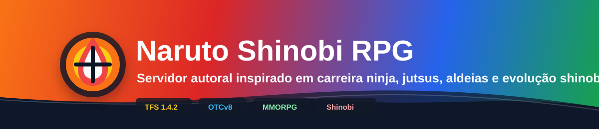

# Naruto Game

<a href="#conceito">⚡ Conceito</a> · <a href="#mundo">🗺️ Mundo</a> · <a href="#personagem">👤 Personagem</a> · <a href="#progressão-e-combate">🥋 Progressão e combate</a> · <a href="#sistemas-e-economia">💰 Sistemas</a> · <a href="#técnico">🛠️ Técnico</a> · <a href="#planejamento">🧭 Planejamento</a>

> Menus por tema, submenus por assunto e navegação direta para cada documento principal.

---

## Conceito

<strong>⚡ Abrir conceito</strong>

| Documento | Tema |
| --- | --- |
| [Visão geral](00-visao-geral.md) | Resumo da proposta e do MVP |
| [Estrutura original](../estrutura-ideia-servidor-naruto.md) | Documento base do projeto |

## Mundo

<strong>🗺️ Abrir mundo</strong>

| Documento | Tema |
| --- | --- |
| [História do mundo](mundo/historia-do-mundo.md) | Lore, aldeias e contexto |
| [Aldeias, NPCs e missões da aldeia](mundo/aldeias-npcs-missoes-da-aldeia.md) | Estrutura social da aldeia |
| [Mapa e regiões](mundo/mapa-regioes.md) | Exploração e regiões iniciais |

## Personagem

<strong>👤 Abrir personagem</strong>

| Documento | Tema |
| --- | --- |
| [Criação de personagem](personagem/criacao-de-personagem.md) | Entrada do jogador no mundo |
| [Sistema de chakra](personagem/chakra.md) | Consumo, controle e regeneração |
| [Atributos](personagem/atributos.md) | Vida, chakra e atributos principais |
| [Atributos e builds](sistemas/atributos-builds.md) | Variações de build e progressão |

## Progressão e combate

<strong>🥋 Abrir progressão e combate</strong>

| Documento | Tema |
| --- | --- |
| [Progressão](sistemas/progressao.md) | Evolução geral do personagem |
| [Ranks ninja](sistemas/ranks-ninja.md) | Academia, Genin, Chunin e acima |
| [Elementos](sistemas/elementos.md) | Afinidades elementais |
| [Kekkei Genkai](sistemas/kekkei-genkai.md) | Combinações e requisitos especiais |
| [Especializações](sistemas/especializacoes.md) | Caminhos de combate e domínio |
| [Sistema de jutsus](sistemas/sistema-de-jutsus.md) | Estrutura, custo e balanceamento |
| [Catálogo de jutsus](sistemas/catalogo-de-jutsus.md) | Lista organizada de técnicas |
| [Maestria](sistemas/maestria.md) | Evolução por uso |
| [Slots de jutsus](sistemas/slots-de-jutsus.md) | Limites de equipagem |
| [Sistema PvP](combate/pvp.md) | Arena, guerras e torneios |
| [Balanceamento](sistemas/balanceamento.md) | Escala, fórmulas e ajustes |

## Sistemas e economia

<strong>💰 Abrir sistemas</strong>

| Documento | Tema |
| --- | --- |
| [Missões](sistemas/missoes.md) | Conteúdo de progressão e recompensa |
| [Clãs](sistemas/clas.md) | Habilidades e identidade de grupo |
| [Economia](sistemas/economia.md) | Dinheiro, mercado e circulação |
| [Itens, equipamentos e raridade](sistemas/itens-raridade-equipamentos.md) | Progressão por loot e equipagem |
| [Crafting, profissões e coleta](sistemas/crafting-profissoes-coleta.md) | Produção e recursos |
| [Dungeons e bosses](sistemas/dungeons-bosses.md) | Conteúdo de grupo e desafio |
| [Eventos e estações](sistemas/eventos-estacoes.md) | Conteúdo dinâmico |
| [Casas e habitação](sistemas/habitacao-casas.md) | Economia social e moradia |

## Técnico

<strong>🛠️ Abrir técnico</strong>

| Documento | Tema |
| --- | --- |
| [Estrutura do servidor TFS](tecnico/estrutura-servidor-tfs.md) | Base técnica e organização |
| [Estrutura do cliente OTCv8](tecnico/estrutura-cliente-otcv8.md) | UI, módulos e experiência |

## Planejamento

<strong>🧭 Abrir planejamento</strong>

| Documento | Tema |
| --- | --- |
| [Roadmap](planejamento/roadmap.md) | Fases do projeto |
| [Backlog](planejamento/backlog-ideias.md) | Ideias e expansões futuras |
| [Princípios do projeto](planejamento/principios-do-projeto.md) | Regras de design |
| [Template de sistema](TEMPLATE-SISTEMA.md) | Padrão para novos documentos |

